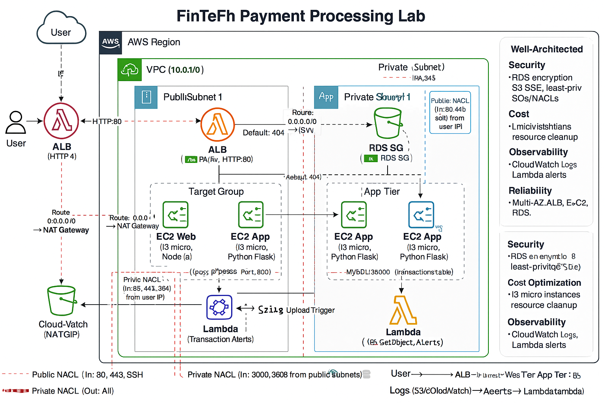
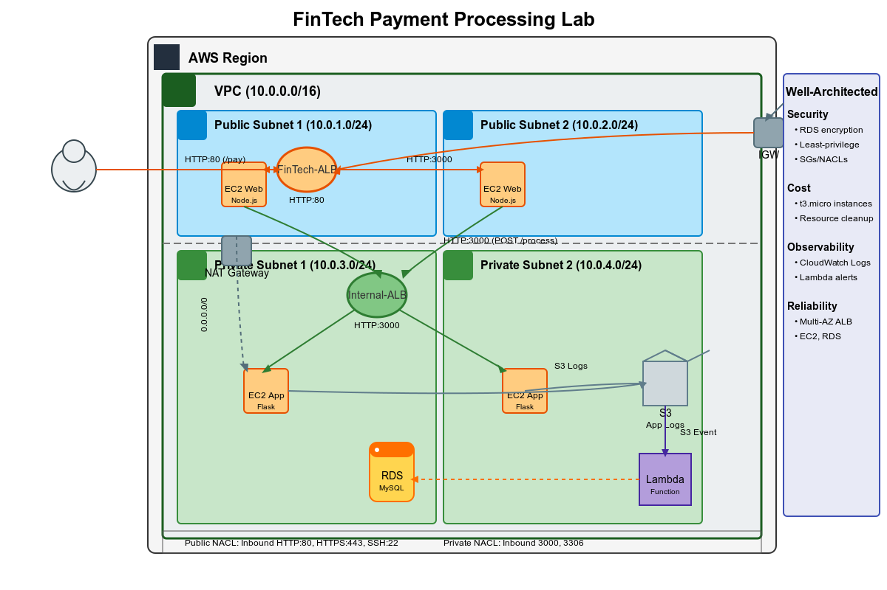

# FinTech Payment Processing Lab: Secure Multi-Tier AWS Pipeline

**By Ember Cloud LLC**

This repository documents the manual provisioning and architectural hardening of a secure, scalable 3-tier FinTech payment processing pipeline on AWS. Built entirely without automation frameworks (at first) to master the low-level mechanics of core AWS infrastructure, this project simulates an enterprise-grade financial transaction pipeline integrating application load balancers, multi-AZ subnets, strict security boundaries, and decoupled backend compute.

---

## Architecture Overview

### End-to-End Workflow

*This diagram illustrates the end-to-end asynchronous workflow of the payment processing system, from public edge ingestion to downstream transaction persistence.*

### Detailed Architecture Breakdown

*This schematic highlights the isolation design of the 3-tier architecture, emphasizing subnet boundaries, Network Access Control Lists (NACLs), and AWS Well-Architected Framework compliance.*

**Core Traffic Engineering Lifecycle:**
1. **Public Edge Ingestion:** External client traffic hits a public-facing, internet-facing Application Load Balancer (ALB) over HTTP/80.
2. **Web Tier Processing:** The public ALB distributes incoming payloads across a pool of Node.js servers hosted on EC2 `t3.micro` instances residing safely within public subnets.
3. **Internal Microservice Routing:** The Web Tier issues secure upstream POST requests to a private, internal ALB (DNS: `internal-FinTech-Internal-ALB-986761868.us-west-2.elb.amazonaws.com`) on port 3000. 
4. **App Tier Execution:** The internal ALB proxies the payloads across isolated Flask application servers running on EC2 instances inside private subnets via the `/process` target route.
5. **Decoupled Logging & ETL:** The Flask application tier processes the payment, generates secure event receipts, and writes logs directly to an Amazon S3 bucket.
6. **Data Tier Persistence:** Object creation hooks in the S3 bucket instantly trigger an asynchronous AWS Lambda worker. The function normalizes the logs and securely injects the financial records into an encrypted Amazon RDS MySQL database housed in the private data tier subnets.

---

## Technology Stack

| Layer | Service / Component | Operational Purpose |
| :--- | :--- | :--- |
| **Compute** | EC2 (`t3.micro` Node.js & Flask) | Distributed hosting of decoupled Web and App Tier processing clusters. |
| **Load Balancing** | Dual Application Load Balancers (ALBs) | High-availability traffic routing, endpoint abstraction, and layer-7 isolation. |
| | *- Public-Facing ALB* | Perimeter edge routing for external consumer HTTP entry points. |
| | *- Private Internal ALB* | Secure, isolated mid-tier routing to prevent direct App exposure. |
| **Storage** | Amazon S3 | Durable, immutable audit log storage serving as an event provider. |
| **Database** | Amazon RDS (MySQL) | Encrypted transactional relational state storage. |
| **Serverless Compute** | AWS Lambda | Event-driven, asynchronous ETL worker processing log records. |
| **Security Architecture** | IAM Policies, Security Groups, Network ACLs | Multi-layered perimeter security, stateful firewalls, and stateless subnets. |
| **Networking Fabric** | Custom VPC Topology | Software-defined network utilizing strict public, private, and data subnets. |

---

## Engineering Breakthroughs & Deep Diagnostics

* **Layer-7 Debugging (504 Gateway Timeout):** Diagnosed and remediated recurrent `504 Gateway Timeout` errors at the edge by precisely realigning the public ALB timeout parameters with upstream Node.js socket readiness thresholds and optimization metrics.
* **Target Group Optimization:** Engineered granular health check paths (`/health` route on port 3000) for the `AppTier-TG-3000` target group, resolving intermittent dropouts through aggressive stabilization of interval windows.
* **Network Isolation Context:** Designed a highly defensive internal infrastructure loop. Installed system dependencies on isolated private EC2 nodes by dynamically attaching ephemeral NAT Gateways for egress package fetching, instantly dismantling the NAT routes post-compilation to prevent perpetual outbound exposures.
* **Event-Driven Security Isolation:** Wired native S3 object triggers to serverless execution states. Hardened the Lambda runtime execution role by applying granular IAM boundaries restricted exclusively to minimum viable permissions (`s3:GetObject` and `logs:PutLogEvents`).

---

## Verifying the Architecture

### 1. Execute an Edge Integration Transaction Request
Fire a mock payment payload directly at your public boundary endpoint (substitute your active public ALB DNS alias below):

```bash
curl -X POST http://<external-alb-dns>/pay \
  -H "Content-Type: application/json" \
  -d '{"id": "test123", "transaction": "roundtrip"}'
