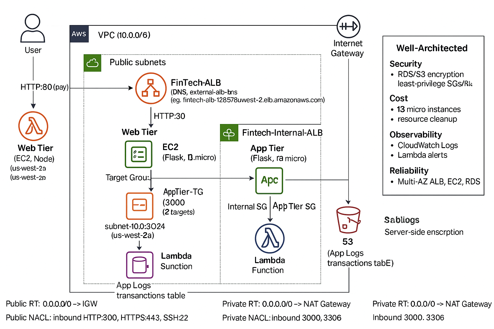

# FinTech Payment Processing Lab: Secure Multi-Tier AWS Pipeline

This project deploys a secure, scalable FinTech payment processing pipeline on AWS, simulating a real-world 3-tier architecture with zero automation to master every component manually. This is my **second full-stack infrastructure project on AWS**, built from scratch as part of my hands-on learning journey. I’m studying the **AWS ecosystem by doing**, intentionally building without automation (at first) to fully understand every moving part. This project simulates a **real-world, secure multi-tier application pipeline**, integrating load balancers, subnets, security boundaries, and backend services.

---

## Architecture Overview



**Core Workflow:**
1. A user submits a payment via a public-facing Application Load Balancer (ALB) on HTTP/80.
2. The ALB forwards the request to a Node.js server in the Web Tier (EC2 t3.micro instances in public subnets).
3. The Web Tier routes the request to an internal ALB, which forwards to Flask servers in the App Tier (EC2 t3.micro instances in private subnets).
4. Flask processes the payment and writes logs to Amazon S3, triggering a Lambda function.
5. Lambda processes the transaction and stores it in an Amazon RDS MySQL database (private subnets, encrypted).

---

## Tech Stack

| Layer          | Service/Tool         | Purpose                          |
|----------------|----------------------|----------------------------------|
| Compute        | EC2 (Node.js & Flask)| Host Web and App Tier services   |
| Load Balancing | Application Load Balancer (x2) | Route traffic to Web/App Tiers |
| Storage        | Amazon S3            | Store logs and trigger Lambda    |
| Database       | Amazon RDS (MySQL)   | Store transaction data securely  |
| Event-driven   | AWS Lambda           | Process S3 logs and update RDS   |
| Security       | IAM, SGs, NACLs      | Enforce least-privilege access   |
| Networking     | VPC (public & private subnets) | Isolate tiers for security     |

---

### What I Learned

- Troubleshot **504 Gateway Timeout** errors by adjusting ALB health check thresholds and EC2 instance response times.
- Configured **ALB target groups** with proper health checks (port 3000, /health endpoint) and debugged failures.
- Set up an **internal ALB** to route traffic securely to private subnets, ensuring no public access to the App Tier.
- Installed packages on **isolated EC2s** by temporarily enabling NAT Gateway access, then disabling for security.
- Connected **S3 triggers** to Lambda and ensured proper IAM roles for s3:GetObject and logs:PutLogEvents.
- Built a **resilient and secure multi-tier network** with VPC, NACLs, and SGs, following Well-Architected principles.

---

### How to Test the Pipeline

1. Send a payment (replace `<external-alb>` with the ALB DNS name from the AWS Console):
```bash
curl -X POST http://<external-alb>/pay \
  -H "Content-Type: application/json" \
  -d '{"id": "test123", "transaction": "roundtrip"}'

2. Connect to RDS and verify data:
sql

Copy
SELECT * FROM payments.transactions ORDER BY id DESC;


---
### Built Without
- No Terraform, CDK, or CloudFormation (manual setup for learning purposes).
- No managed frontend (Node.js app built from scratch).
- No public RDS (kept private with SGs and NACLs for security best practices).


#### Screenshots
Terminal output, curl responses, AWS Console configurations (e.g., ALB setup in `screenshots/alb-config.png`), and MySQL queries are located in the `screenshots/` folder. Useful for documentation, verification, and future reference.


### Well-Architected Alignment
- **Security**: RDS encryption, S3 server-side encryption, least-privilege SGs/NACLs.
- **Cost Optimization**: Used t3.micro instances, cleaned up resources post-deployment.
- **Observability**: Integrated CloudWatch Logs and Lambda for transaction alerts.
- **Reliability**: Multi-AZ setup for ALB, EC2, and RDS.


### About Me
I'm diving deep into cloud engineering by building real AWS infrastructure from the ground up. I currently hold the Google Associate Cloud Engineer certification and am preparing for the AWS Solutions Architect Associate (SAA) exam. After that, I’m aiming to earn the HashiCorp Terraform Associate and Certified Kubernetes Administrator (CKA) certifications.

Each project I build sharpens my understanding and brings me closer to being job-ready in real cloud environments.

If you're hiring or collaborating, feel free to reach out — I’m motivated, learning fast, and excited to contribute to real-world systems.  
Email: hatelydane@gmail.com
